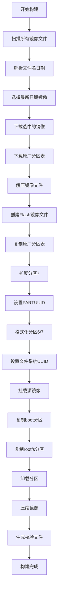

# Flash 镜像构建系统

此构建系统用于创建包含完整分区结构的 Flash 刷机包，特别为 `efused-wxy-oec` 等需要保留原厂分区的设备设计。

## 🚀 快速开始

### 方法 1: 使用 GitHub Actions（推荐）

1. 进入仓库的 **Actions** 页面
2. 选择 **"Build Flash Images"** workflow
3. 点击 **"Run workflow"** 按钮
4. 配置参数后开始构建
5. 构建完成后，Flash 镜像会自动发布到 `Armbian_debian` release

### 方法 2: 本地快速构建

```bash
# 克隆仓库
git clone https://github.com/dd-ray/amlogic-s9xxx-armbian.git
cd amlogic-s9xxx-armbian

# 运行快速构建脚本（需要 sudo 权限）
sudo ./build-latest-flash.sh efused-wxy-oec
```

### 方法 3: 手动构建

```bash
# 下载源镜像
wget https://github.com/dd-ray/amlogic-s9xxx-armbian/releases/download/Armbian_bookworm_save_2025.06/Armbian_25.08.0_rockchip_efused-wxy-oec_bookworm_6.12.33_server_2025.06.15.img.gz

# 构建 Flash 镜像
sudo bash build-armbian/create-flash-image.sh \
  "Armbian_25.08.0_rockchip_efused-wxy-oec_bookworm_6.12.33_server_2025.06.15.img.gz" \
  "efused-wxy-oec" \
  "./output"
```

## 📋 分区结构

Flash 镜像包含 7 个分区的完整结构，严格按照原厂分区布局：

```
┌─────────────────────────────────────────────────────────────────────────┐
│                          Flash 镜像分区布局                             │
├─────────┬─────────────┬─────────┬─────────────────────────────────────────┤
│ 分区号   │ 分区名       │ 大小     │ 描述                                    │
├─────────┼─────────────┼─────────┼─────────────────────────────────────────┤
│ 1       │ uboot       │ 4MB     │ U-Boot 分区 (原厂)                      │
│ 2       │ misc        │ 4MB     │ 杂项分区 (原厂)                         │
│ 3       │ boot        │ 64MB    │ 启动分区 (原厂)                         │
│ 4       │ kernel      │ 64MB    │ 内核分区 (原厂)                         │
│ 5       │ env         │ 32MB    │ 环境变量分区 (原厂)                      │
│ 6       │ boot        │ 512MB   │ Armbian 启动分区 (从源镜像复制)          │
│ 7       │ rootfs      │ 剩余空间 │ Armbian 根文件系统 (从源镜像复制)        │
└─────────┴─────────────┴─────────┴─────────────────────────────────────────┘
```

**🔐 UUID 保护机制**
- 磁盘 GUID: `9F6F0000-0000-4505-8000-6666000042BD`
- 所有分区 PARTUUID 和文件系统 UUID 与原厂保持完全一致
- 确保系统正常识别和启动

**🧠 智能镜像选择**
- 自动扫描 release 中的所有匹配镜像文件
- 解析文件名中的日期信息（如 `2025.06.15`）
- 自动选择日期最新的版本进行构建
- 确保总是使用最新的 Armbian 镜像

## 🛠️ 构建组件

### 1. 核心脚本

- **`build-armbian/create-flash-image.sh`**: 核心构建脚本，负责创建包含7个分区的Flash镜像
- **`build-latest-flash.sh`**: 快速构建脚本，自动下载最新镜像并构建

### 2. GitHub Actions

- **`.github/workflows/build-flash-images.yml`**: 自动化构建工作流，支持：
  - 智能选择最新日期的源镜像
  - 自动下载和构建Flash镜像
  - 上传到指定release
  - 生成SHA256校验文件

### 3. 文档

- **`documents/flash_image_build_guide.md`**: 详细的构建和使用指南
- **`README-Flash-Build.md`**: 本文件，系统概述

## 📦 输出文件

构建完成后会生成以下文件：

```
Flash_Armbian_25.08.0_rockchip_efused-wxy-oec_bookworm_6.12.33_server_2025.06.15.img.zip
Flash_Armbian_25.08.0_rockchip_efused-wxy-oec_bookworm_6.12.33_server_2025.06.15.img.zip.sha256
```

## 🔧 使用 Flash 镜像

1. **下载**: 从 [Armbian_debian release](https://github.com/dd-ray/amlogic-s9xxx-armbian/releases/tag/Armbian_debian) 下载
2. **验证**: `sha256sum -c Flash_*.img.zip.sha256`
3. **解压**: `unzip Flash_*.img.zip`
4. **刷写**: 使用 `rkdevtool` 写入到设备 Flash 存储

## ⚠️ 重要提醒

- **备份数据**: 刷写前务必备份重要数据
- **确认设备**: 确保镜像适用于您的设备型号
- **断电风险**: 刷写过程中不要断电
- **原厂分区**: Flash镜像会覆盖所有分区，包括原厂分区

## 🔍 技术原理

1. **分区创建**: 使用 `sgdisk` 创建 GPT 分区表
2. **数据复制**: 通过循环设备挂载进行文件系统级复制
3. **完整性保证**: 
   - 支持多种压缩格式 (.gz, .xz, .zip)
   - 自动校验和清理
   - 错误处理和回滚

## 🤝 支持的设备

目前支持：
- **efused-wxy-oec**: 完全支持
- **其他设备**: 计划中

## 📊 构建流程



## 🐛 故障排除

| 问题 | 原因 | 解决方案 |
|------|------|----------|
| 构建失败 | 源镜像损坏 | 重新下载源镜像 |
| 权限错误 | 非root用户 | 使用 `sudo` 运行 |
| 空间不足 | 磁盘空间不够 | 清理磁盘空间 |
| 分区错误 | 设备占用 | 卸载相关设备 |

## 📈 版本历史

- **v1.0**: 初始版本，支持 efused-wxy-oec
- **v1.1**: 添加自动化构建
- **v1.2**: 优化错误处理和文档

## 🎯 路线图

- [ ] 支持更多设备类型
- [ ] 增量更新支持
- [ ] 可视化构建界面
- [ ] 自动化测试框架

## 📞 获取帮助

- **问题报告**: [GitHub Issues](https://github.com/dd-ray/amlogic-s9xxx-armbian/issues)
- **功能请求**: [GitHub Discussions](https://github.com/dd-ray/amlogic-s9xxx-armbian/discussions)
- **文档**: [documents/flash_image_build_guide.md](documents/flash_image_build_guide.md)

---

**⚡ 提示**: 使用 GitHub Actions 是最便捷的构建方式！ 